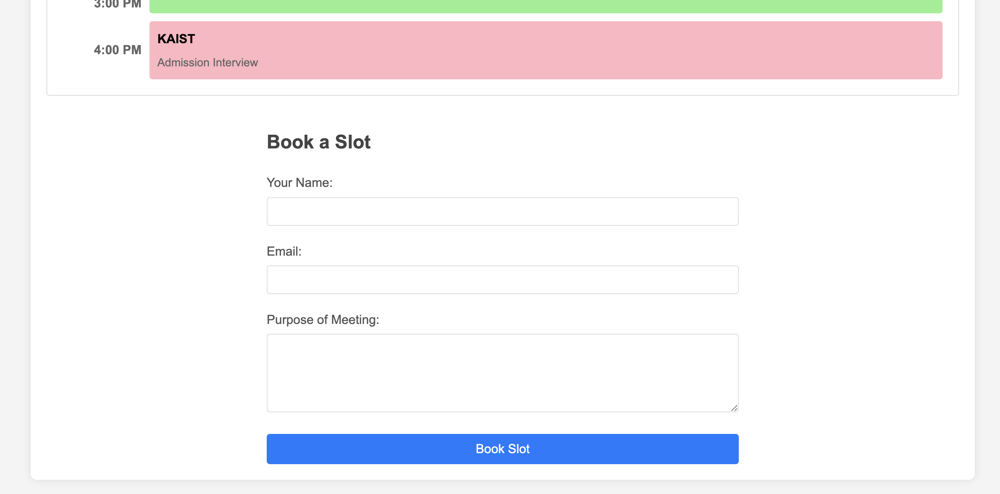

## How to run the project

1. Clone the repository
2. Run `npm install`
3. Run `npm start`
4. Open `index.html` in your browser

## How to use the project

1. Select a date
2. Select a time slot
3. Fill in the form
4. Click `Book Slot`

## How to run the server

1. Run `npm install`
2. Run `node server.js`
3. Open `index.html` in your browser

## How does the project work?

The project uses a server to store the bookings. The server is running on `localhost:3000`. The server is used to store the bookings and to fetch the bookings.

The project uses a client to display the calendar and to book the slots. The client is running on `localhost:3001`. The client is used to display the calendar and to book the slots.

The client uses the server to fetch the bookings and to store the bookings.

The client uses the server to fetch the available slots for a given date.

The client uses the server to book a slot.

The client uses the server to fetch the bookings for a given date.

The client uses the server to fetch the bookings for a given date range.